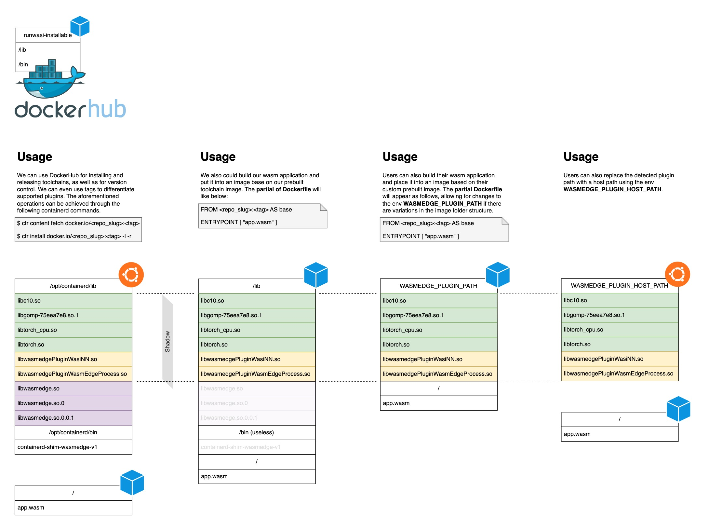

# Overview

All of our new installation workflow and plugin detection mechanism can be illustrated using the following diagram.



**Warning:**

The following features are closely related to the mechanism of **[containerd managing opt](https://github.com/containerd/containerd/blob/main/docs/managed-opt.md)**. If the shim is not installed through the installation method, the automatic path detection advantages cannot be enjoyed. You will still need to manually expose the bin and lib search paths to the service before you run with ctr or docker.


And when you want to restore the default system path for searching the runtime instead of force searching from `/opt/containerd`, you need restart your service.

```
sudo systemctl daemon-reload && sudo systemctl restart containerd
```


## Installation

Here, we have added continuous integration (CI) to automatically build the new DockerHub image, named "runwasi-installable," and the image content structure is explained as follows:

```
.
├── bin
│   // shim binary
└── lib
    // dylibs of wasmedge, plugins and its dependencies
    // by default, we put wasi-nn plugin into it as demo.
```

So we could easily use the commands below to install and use tag do version control or feature selection in the future.

```bash
sudo ctr content fetch docker.io/vincent2nd/runwasi-installable:latest
sudo ctr install docker.io/vincent2nd/runwasi-installable:latest -l -r
```

## Plugin

Currently, we provide the functionality of automatic plugin loading, following the principles outlined below. By default, the search path for plugins is set to `/opt/containerd/lib` on host. This search path can be overridden by two environment variables, namely `WASMEDGE_PLUGIN_PATH` and `WASMEDGE_PLUGIN_HOST_PATH`. These variables can be used to specify custom paths from a Docker image or the host system, respectively.

### Demo

Here, we showcase features using the `wasi-nn` plugin, which includes our prebuilt image, runwasi-install. We also provide a comprehensive demonstration of how to use it in CI.
- [Case 1](https://github.com/CaptainVincent/runwasi/blob/9fe6fc72d2fd78fc15ae1286daecf578273f2513/.github/workflows/ci.yml#L95-L132) - The default approach is to use the built-in plugin through an installed shim.
- [Case 2](https://github.com/CaptainVincent/runwasi/blob/9fe6fc72d2fd78fc15ae1286daecf578273f2513/.github/workflows/demo.yml#L107-L125) - By specifying the `WASMEDGE_PLUGIN_HOST_PATH`, the location of the plugin is informed. In this case, I took a shortcut and did not use the installation method to install the shim, so the path to libtorch is still configured through ldconfig. If the installation method is used, it is sufficient to place libtorch and the plugin in the same directory.

## Run with Docker (Moby)

Setup moby
```bash
git clone https://github.com/moby/moby.git
cd moby
git checkout v24.0.0
cp {vendor,go}.mod
cp {vendor,go}.sum
```

Create daemon.json
```json
{
    "features": {
        "containerd-snapshotter": true
    }
}
```

Run moby
```bash
hack/make.sh binary && sudo ./bundles/binary-daemon/dockerd -D -H unix:///tmp/docker.sock --data-root /tmp/root --pidfile /tmp/docker.pid --config-file daemon.json
```

Run wasinn demo (need install wasmedge shim first)
```
docker context create local --docker "host=unix:///tmp/docker.sock"
docker context use local
cd runwasi/demo
docker compose up wasinn
```
